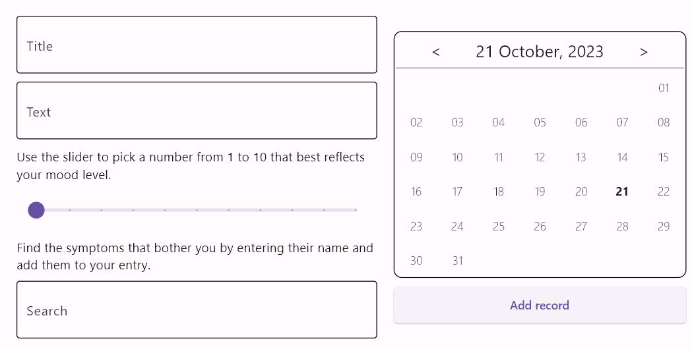
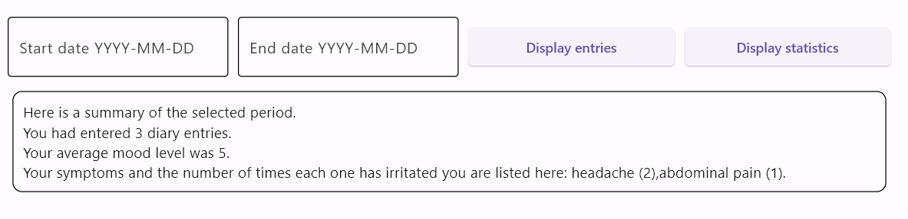

# Diary
## Description
The idea of the project was inspired by the journaling technique, commonly used as a part of mental health care.  
The Diary allows users to create and store entries, including notes, mood levels, symptoms, and complaints for the date 
of the entry, display entries, and show statistics for the specified period of time.  
The Diary is a desktop application, developed using the [Flet framework](https://flet.dev/) , 
a UI framework for Python. Flet controls are based on Flutter by Google.
## Information for users 
The application's interface is separated into 2 main parts: 
1. the interface for entering and creating an entry,
2. the interface for displaying the list of entries or statistics.

**The interface for entering and creating an entry**



Using the interface a user can input text into the appropriate fields to specify the title of the entry and provide 
a text note, adjust the mood level using the slider, and use the search feature to include any worrisome symptoms. 
Additionally, users have the option to create entries not only for the current day but also for past days.

**The interface for displaying the list of entries**

 

**and statistics**

  

Users have the option to toggle between viewing a list of entries and displaying statistics by clicking 
either the 'Display entries' or 'Display statistics' buttons. 
Furthermore, users can choose to specify start and end dates if they only want entries from a particular time period.
## Information for developers
The logic of the application derives from the interaction of the parts responsible for creating records, 
storing records, and displaying a list of records and statistics.  
The ```RecordCreatorView``` class is responsible for creating records, including all its features such as
text entry fields, a slider to set the mood level, a symptom search from a predefined list, and a calendar for selecting 
the day of the record.  
The ```RecordListDB``` class provide storage and access to records using ```sqlite3``` Python module. 
Records are stored in a dedicated database file, which is generated upon the initial execution of the application.  
The ```ViewModel``` class is an integral component of the Model-View-ViewModel design pattern, serving as a controller 
responsible for generating and modifying UI elements in the View to display a list of entries and statistics.  
#### Further development plan is to create following features:

 - [ ] a reminder to enter the entry for the day in the diary;
 - [ ] a feature that allows users to input start and end dates for display through the selection of dates 
from a dropdown calendar; 
 - [ ] a feature that allows adding a symptom to a record, even if that symptom is not yet in the list of symptoms, 
with its further addition. 
 - [ ] completing the list of symptoms in the ```RecordCreatorView``` class.   

For any questions and suggestions, I can be reached via email at evgygyx@gmail.com.
## License
The Diary is licensed under the GNU General Public License v3.0.